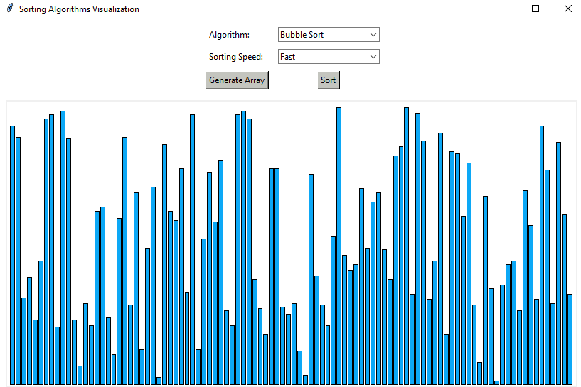
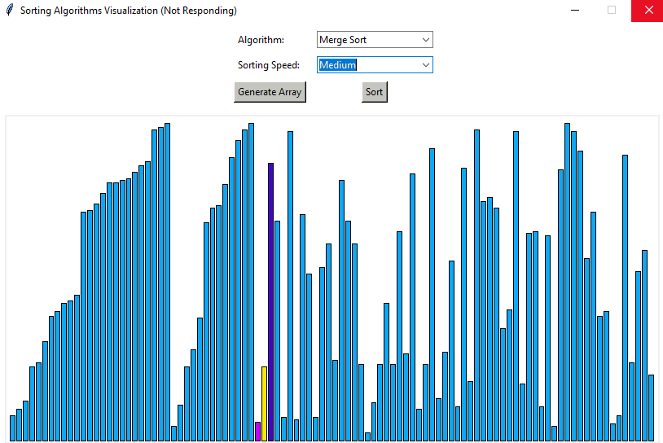
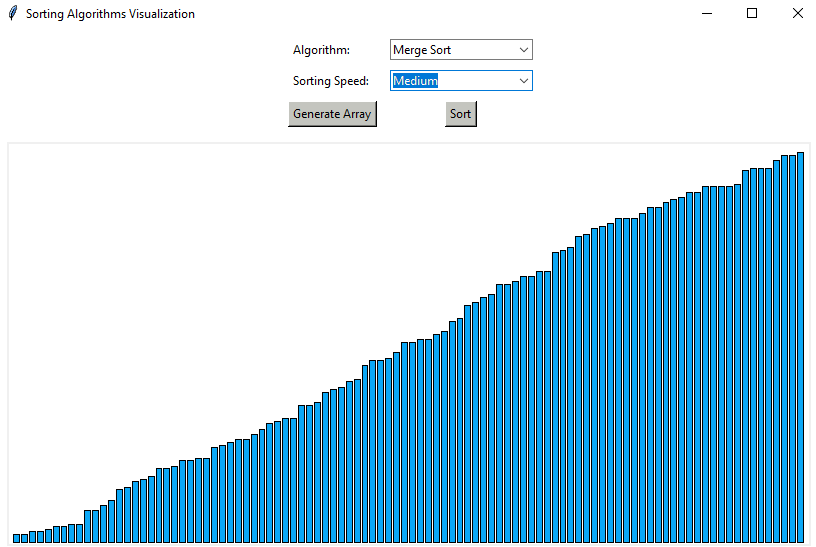

# Sorting Algorithms Visualizer
<p>A python application to visualize popular sorting algorithms.</p>




## Implemented Algorithms:
* Bubble Sort 
* Insertion Sort 
* Selection Sort 
* Merge Sort 
* Quick Sort 
* Heap Sort 
* Counting Sort
----------------------------------------------------------------------------------------------------------------------------------------
## Built With:
* Python 3.7.7
* Tkinter 8.6
----------------------------------------------------------------------------------------------------------------------------------------
## Run It:
<p> Clone the repository </p>

```
$ git clone https://github.com/FahadulShadhin/Sorting-Algorithms-Visualizer.git
```

<p>Run <strong>main.py</strong><p>

```cmd
$ python main.py 
or
$ python3.7 main.py
```
  
