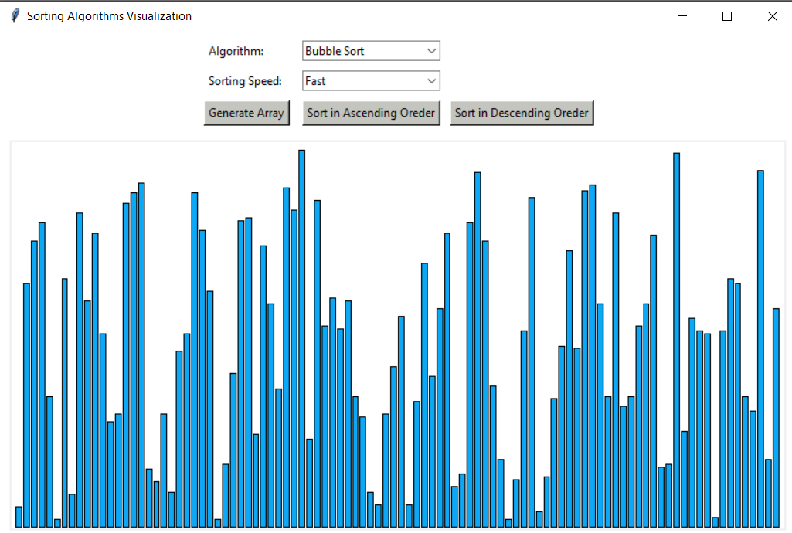
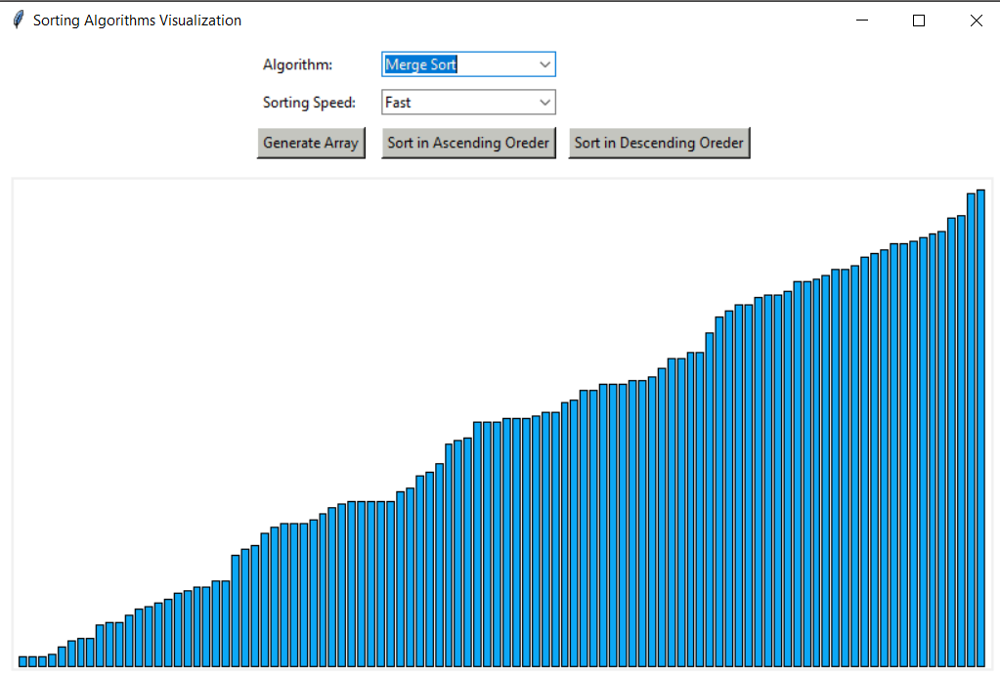

# Sorting Algorithms Visualizer
A python application to visualize popular sorting algorithms. It's a simple desktop application to graphically visualize commonly studied sorting algorihtms. It can sort a randomly generated array in both ascending and descending order and also show the steps while sorting. 
#### Algorithms Implemented:
* Bubble Sort 
* Insertion Sort 
* Selection Sort 
* Merge Sort 
* Quick Sort 
* Heap Sort 
* Counting Sort
----------------------------------------------------------------------------------------------------------------------------------------
## Technologies:
The project is created with:
* Python 3.7.7
* Tkinter 8.6
----------------------------------------------------------------------------------------------------------------------------------------
## Requirements:
* Python 3.7
<p>Run <strong>main.py</strong><p>

```cmd
python main.py
python3.7 main.py
```

 <p>Or, go to <strong>dist</strong> folder and run <strong>main.exe</strong> directly from there. (for windows)</p>

----------------------------------------------------------------------------------------------------------------------------------------
## Screenshots:
Example of before and after sorting...

<p align="center"></p>
<p align="center"></p>
